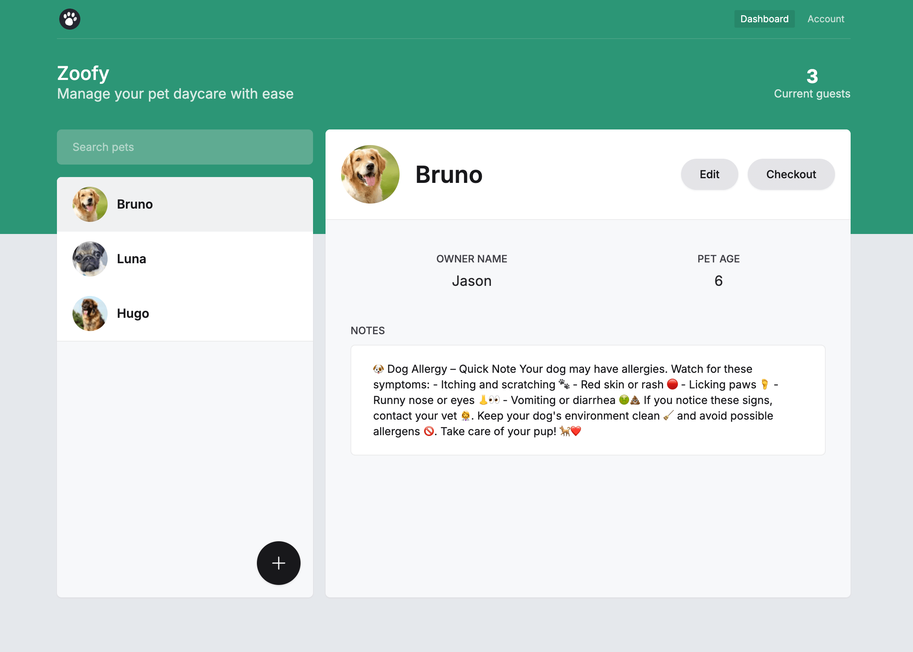

## <a> 🖥️&nbsp;&nbsp; Zoofy (Fullstack)</a>

    <a href="https://rr-zoofy.vercel.app" target="_blank"
        >Live demo - see it in action</a
    >

    <a href="https://github.com/Rapkowsky/zoofy" target="_blank"
        >Github repo - see more details</a
    >

    

    

	Zoofy is a full-stack web application designed to perform CRUD (Create, Read,
	Update, Delete) operations. Zoofy delivers a seamless and efficient user
	experience for managing data. Additionally, the application includes
	authentication functionality powered by NextAuth, enabling secure user login
	and session management.

<h4>Core features</h4>
<ul>
	<li>User Registration: Create new user accounts.</li>
	<li>Authentication: Log in and log out securely using NextAuth.</li>
	<li>Payment System: Integrated payment functionality.</li>
	<li>
		Pet Management:
		<ul>
			<li>Add a new pet to the database.</li>
			<li>Edit existing pet details.</li>
			<li>View the list of created pets.</li>
			<li>Delete pets from the database.</li>
		</ul>
	</li>
</ul>
